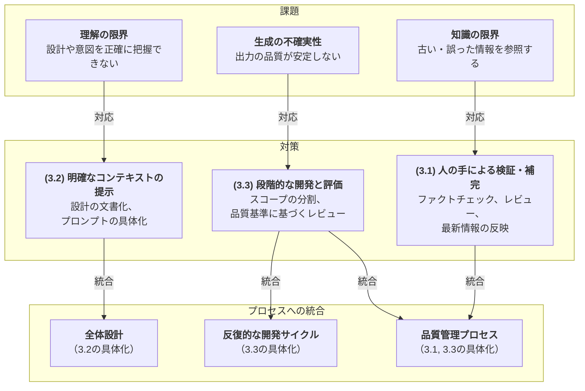

# 生成AIを活用したソフトウェア開発ガイド

## 1. はじめに

### 1.1 本ドキュメントについて
このドキュメントは、生成AIを活用したソフトウェア開発を始めようとする開発者向けのガイドラインです。生成AIの特性を理解し、その長所を活かしながら短所を適切に制御するための具体的な手法を提案します。

### 1.2 想定読者
- 生成AIを用いた開発を始めようとしている開発者
- 生成AIを活用した開発プロセスを確立したいチームリーダー
- 生成AIを用いた開発の品質を向上させたい開発者

### 1.3 本ドキュメントの目的
生成AIを用いて開発する際の重要な考慮点を明示し、マイナスの側面を適切に抑制しながら効果的に開発を進めるための具体的な手法を提示することを目的としています。

### 1.4 各章の関連性
本ドキュメントは、以下の図に示すように、「課題の認識」「対策の立案」「プロセスへの統合」という流れで構成されています。2章で生成AIの根本的な課題を提示し、3章でそれぞれの課題に対する戦略的な対策を、そして4章でそれらの対策を具体的な開発プロセスに落とし込む方法を解説します。



## 2. 生成AIの特性

### 2.1 ポジティブな特性
1. **高速なコード生成**
   - 基本的な実装の素早い生成
   - ボイラープレートコードの自動生成
   - 定型的なタスクの効率化

   生成AIは、人間の開発者が手作業で行うコーディングと比較して、はるかに高速にコードを生成することができます。特に、基本的なCRUD操作やデータモデルの実装、APIエンドポイントの作成などの定型的なタスクにおいて、その効果を発揮します。また、プロジェクトの初期設定やボイラープレートコードの生成も、テンプレートに基づいて迅速に行うことができ、開発の立ち上げフェーズを大幅に短縮することが可能です。

2. **広範な知識ベース**
   - 多様な技術スタックへの対応
   - ベストプラクティスの提案
   - 一般的な問題解決パターンの提示

   生成AIは、膨大な量のコードやドキュメントを学習しており、様々な技術スタックやフレームワークに関する知識を持っています。これにより、特定の問題に対して、業界で広く採用されているベストプラクティスや設計パターンを提案することができます。また、異なる技術間の統合方法や、特定の機能の実装方法について、実践的な提案を行うことができます。

3. **柔軟な対話性**
   - インタラクティブな問題解決
   - 段階的な要件の具体化
   - 説明の詳細化や簡略化

   生成AIは、開発者との対話を通じて問題解決を進めることができます。要件が曖昧な場合でも、質問を通じて具体化を図り、段階的に解決策を提示することが可能です。また、技術的な説明についても、開発者の理解度や要望に応じて、詳細な説明や簡潔な要約を提供することができ、効果的なコミュニケーションツールとして機能します。

### 2.2 注意すべき特性（マイナスの側面）
1. **知識の限界**
   - 学習データのカットオフ
   - ハルシネーション（情報の捏造）

   生成AIの知識は、学習させたデータに依存します。そのため、学習データが収集された特定の日時（カットオフ）より新しい情報を反映できません。これは、最新のライブラリやフレームワーク、セキュリティ脆弱性に対応できず、古いバージョンや非推奨の構文をベースにしたコードを生成してしまうリスクに繋がります。また、事実に基づかない情報（ハルシネーション）をもっともらしく生成することもあり、開発者が誤った情報に基づいて判断を下す危険性も内包しています。

2. **理解の限界**
   - 長期的な文脈の維持が困難
   - 複雑な依存関係の把握が不完全
   - 開発者の意図の誤解釈

   生成AIは、対話における短期的な文脈は理解できますが、プロジェクト全体の設計思想や、コンポーネント間の複雑な依存関係、長期的な開発経緯といった広範なコンテキストを完全に把握することは困難です。このため、全体設計との整合性が取れないコードを生成したり、開発者の暗黙の意図を汲み取れずに要件から逸脱した過剰な機能（スコープクリープ）を提案・実装したりする可能性があります。これが「スコープ制御の難しさ」に繋がります。

3. **生成の不確実性**
   - 出力の確率的な性質
   - 品質のばらつきと一貫性の欠如

   生成AIの出力は確率モデルに基づいているため、同じプロンプト（指示）に対しても、実行するたびに異なる結果を生成する可能性があります。これは、コードの品質にばらつきを生じさせ、時には最適でない実装や、エッジケースを考慮しない、あるいはセキュリティ上の脆弱性を含むコードが生成されるなど、直接的な「品質保証の課題」を引き起こします。

## 3. 課題への対策

### 3.1 「知識の限界」への対策：人の手による検証・補完
1. **セキュリティ対策の徹底**
   - **脆弱性スキャンの定期実施**: 生成AIは過去の脆弱性情報に基づいてコードを生成する可能性があるため、既知の脆弱性が含まれていないかスキャンツールで定期的に確認します。
   - **セキュリティレビューの実施**: 専門家の視点で、生成されたロジックに潜在的なセキュリティホールがないかレビューします。
   - **依存関係の管理**: 使用しているライブラリやフレームワークに古いバージョンが選択されていないか確認し、常に安全なバージョンを利用するよう管理します。

2. **ファクトチェックと最新情報の反映**
   - **情報の正確性検証**: 生成AIが提示する情報（特にライブラリの仕様やAPIの利用法）が正確であるか、公式ドキュメントなどで必ず確認（ファクトチェック）します。
   - **カットオフの意識**: AIの知識が古いことを念頭に置き、最新の技術標準やベストプラクティスを人間が補完します。

### 3.2 「理解の限界」への対策：明確なコンテキストの提示
1. **設計ドキュメントの整備**
   - **アーキテクチャ図の維持**: システム全体の構造を視覚的に示すことで、AIと開発者の共通認識を形成します。
   - **インターフェース定義の明確化**: APIの仕様などを厳密に定義し、コンポーネント間の連携における誤解を防ぎます。
   - **データモデルの文書化**: データの構造を明確にすることで、一貫性のあるデータ処理をAIに指示します。

2. **プロンプト管理の徹底**
   - **プロンプトテンプレートの活用**: 必要な背景情報、制約条件、期待する出力形式などをテンプレート化し、指示の精度を高めます。
   - **コンテキスト情報の明示**: 対話の際には、関連する設計ドキュメントや過去の決定事項を明示的にインプットとして提供します。

3. **トレーサビリティの確保**
   - **要件とコードの紐付け**: Issueトラッカーなどを活用し、どの要件に基づいてコードが生成されたかを追跡可能にします。
   - **決定事項の記録**: 設計変更などの重要な決定を記録・共有し、コンテキストが失われるのを防ぎます。

### 3.3 「生成の不確実性」への対策：段階的な開発と評価
1. **段階的な開発アプローチ**
   - **全体設計の明確化**: 最初に全体像を固め、AIに実装を依頼する範囲を限定します。
   - **フェーズごとの目標設定**: 開発を管理可能な小さなステップに分割し、各ステップのゴールを明確にします。
   - **完了条件の具体化**: 「何ができたら完了か」を客観的に測定できる基準（受け入れ基準）として定義します。

2. **品質基準の確立**
   - **コーディング規約の策定**: 一貫したコードスタイルを強制し、出力のばらつきを抑制します。
   - **テスト基準の設定**: 単体テストのカバレッジ目標などを定め、最低限の品質を担保します。
   - **レビュー基準の明確化**: コードレビューの観点を事前に定義し、評価の属人性を排除します。

3. **検証プロセスの強化**
   - **自動テストの充実**: 生成されたコードが既存の機能を破壊しないか、リグレッションテストを自動化して常に監視します。
   - **コードレビューの徹底**: AIの生成物であっても、人間が書いたコードと同様に必ずレビューを実施します。
   - **静的解析の活用**: ツールを用いて潜在的なバグやコードの不備を機械的に検出し、品質のベースラインを維持します。

## 4. 具体的な開発手法（対策のプロセスへの統合）

### 4.1 開発プロセスの概要
本ガイドで提案する開発プロセスは、前章で述べた対策を実践に統合するための具体的なフレームワークです。

1. **全体設計フェーズ**
   - **目的**: プロジェクトの土台を固め、AIに正確なコンテキストを渡す準備を整える（「3.2 理解の限界」への対策の具体化）。
   - **活動**: システム要件の定義、アーキテクチャの設計、技術スタックの選定、主要なデータモデルやインターフェースの定義など。

2. **フェーズ分解**
   - **目的**: 開発全体を管理可能な単位に分割し、段階的に開発を進める（「3.3 生成の不確実性」への対策の具体化）。
   - **活動**: 機能の優先順位付け、依存関係の分析、マイルストーンの設定。

3. **反復的な開発サイクル**
   - **目的**: 小さなサイクルを繰り返すことで、手戻りを最小限に抑えつつ、継続的に品質を評価・改善する（「3.3 生成の不確実性」への対策の具体化）。
   - **サイクル**: 詳細設計 → 実装 → テスト → レビュー。

### 4.2 各フェーズでの具体的なステップ
1. **フェーズ開始時**
   - **目的**: 各開発フェーズの方向性を明確にし、評価基準を定める。
   - **活動**: 目標の明確化、受け入れ基準の設定、リスクの特定。

2. **開発中**
   - **目的**: 定期的なレビューを通じて、品質を維持し、問題点を早期に発見する。
   - **活動**: 定期的なレビュー、進捗の可視化、問題点の早期発見。

3. **フェーズ完了時**
   - **目的**: 成果物を検証し、次のサイクルに知見を活かす。
   - **活動**: 完了条件の確認、成果物の検証、振り返りの実施。

### 4.3 品質管理プロセス
**目的**: 開発の全段階を通じて、生成されたコードの品質と安全性を多角的に保証する（「3.1 知識の限界」「3.3 生成の不確実性」への対策の具体化）。

1. **コードレベルの品質管理**
   - **内容**: コーディング規約の遵守、テストカバレッジの確保、静的解析の実施。
   - **役割**: 生成されたコードの基本的な品質と一貫性を担保する。

2. **ドキュメントレベルの品質管理**
   - **内容**: 設計書の更新、APIドキュメントの整備、変更履歴の管理。
   - **役割**: 開発のコンテキストを維持し、将来の変更に備える。

3. **プロセスレベルの品質管理**
   - **内容**: レビュープロセスの最適化、CI/CDパイプラインの整備、モニタリングの強化。
   - **役割**: 品質保証の仕組みを自動化・効率化し、継続的な改善を促す。

## 5. 実践のためのチェックリスト

### 5.1 プロジェクト開始時
- [ ] 全体設計書の作成
- [ ] 開発プロセスの定義
- [ ] 品質基準の設定
- [ ] ツール・環境の準備

### 5.2 フェーズ開始時
- [ ] 詳細設計書の作成
- [ ] 受け入れ基準の定義
- [ ] リスクの評価
- [ ] タスクの分解

### 5.3 開発サイクル
- [ ] コーディング規約の遵守
- [ ] テストの実施
- [ ] コードレビュー
- [ ] ドキュメント更新

### 5.4 フェーズ完了時
- [ ] 完了条件の確認
- [ ] 成果物の検証
- [ ] 振り返りの実施
- [ ] 次フェーズの準備

## 6. 継続的な改善のために

### 6.1 モニタリング項目
- 品質メトリクス
- パフォーマンス指標
- 生産性指標

生成AIを活用した開発プロセスを継続的に改善するためには、適切なモニタリング項目を設定し、定期的に評価することが重要です。品質メトリクスではコードの品質や不具合の発生率を、パフォーマンス指標ではシステムの応答時間やリソース使用率を、生産性指標では開発速度や生成AIの活用効率を測定します。これらの指標を総合的に分析することで、プロセスの改善点を特定することができます。

### 6.2 改善プロセス
1. データの収集
2. 分析と評価
3. 改善案の作成
4. 実施と検証

継続的な改善を実現するため、体系的な改善プロセスを確立します。まず、設定したモニタリング項目に基づいてデータを収集し、それらを詳細に分析して現状を評価します。その結果に基づいて具体的な改善案を作成し、実施します。実施後は効果を検証し、必要に応じて更なる改善を行います。このサイクルを継続的に回すことで、生成AIを活用した開発プロセスを段階的に最適化していくことができます。

## プロンプト履歴

### 初回作成プロンプト
```
以下の形式でドキュメントを作成してください：

##想定読者
これから生成AIを用いた開発を始めようとしている人

##伝えたい内容・目的
生成AIを用いて開発する際に重要な考慮すべきポイントを明示したうえで、マイナスの側面を適切に抑制しながら効果的に開発を進めるための手法案を提示する

##構成
・生成AIの特性（特にアウトプットの確率的な不安定さなどのマイナスの側面を詳細に解説）
・上記特性に含まれるマイナスの側面を抑制するためのポイント
・上記のポイントを踏まえた具体的な開発手法（案）

##補足
こちらのドキュメントは今後も継続的に追加・修正を加えていく想定です。また追加・修正は生成AIを用いて実施していく想定のため、次回の追加・修正時に生成AIに渡すプロンプトについても、追加・修正したい内容のみ追記すれば良い形で作成し、末尾に追記するようにしてください
```

# 変更履歴
- 2024-06-05: 初版作成 