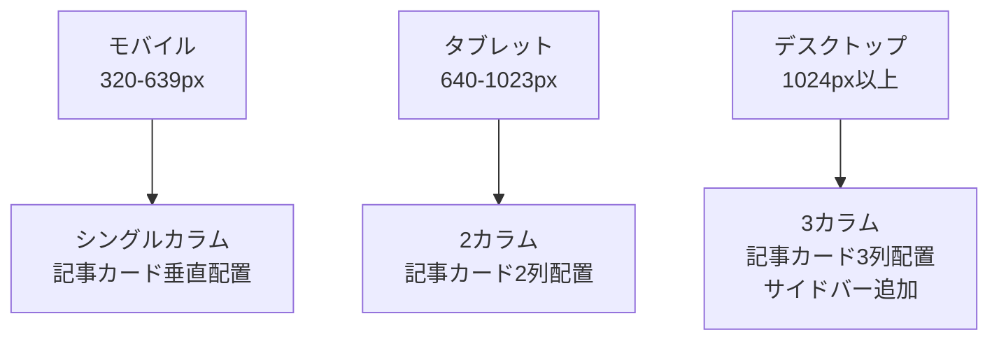

# レスポンシブデザイン対応 詳細設計書

## 1. 概要

- ブログサイトを様々なデバイスサイズ（PC、タブレット、スマートフォン）に対応させる
- Tailwind CSSのユーティリティクラスを活用してレスポンシブレイアウトを実装
- 全体設計（`design.md`）の「UIデザイン要件」に対応

## 2. 実装仕様

### 2.1 ブレークポイント設計

Tailwind CSSのデフォルトブレークポイントを使用：
- `sm:` 640px以上（タブレット縦）
- `md:` 768px以上（タブレット横）
- `lg:` 1024px以上（デスクトップ小）
- `xl:` 1280px以上（デスクトップ大）

### 2.2 レイアウト対応

### 2.3 コンポーネント設計

#### 2.3.1 レイアウトコンポーネント
- `src/lib/components/layout/Header.svelte` - ヘッダーの修正
- `src/lib/components/layout/Footer.svelte` - フッターの修正
- `src/lib/components/layout/Navigation.svelte` - ナビゲーションの追加

#### 2.3.2 記事関連コンポーネント
- `src/lib/components/post/PostCard.svelte` - カードレイアウトの修正
- `src/lib/components/post/PostGrid.svelte` - グリッドレイアウトの追加

#### 2.3.3 管理画面コンポーネント
- `src/routes/(admin)/admin/+layout.svelte` - 管理画面レイアウトの修正
- テーブル表示のレスポンシブ対応

## 3. データモデル

- データモデルの変更は不要
- 既存のAPIエンドポイントをそのまま使用

## 4. UI/UXデザイン

### 4.1 モバイル（〜639px）
- ヘッダー：ハンバーガーメニュー
- 記事一覧：シングルカラム、カード形式
- ナビゲーション：アコーディオン形式
- 管理画面：縦スクロール、テーブルを横スクロール可能に

### 4.2 タブレット（640-1023px）
- ヘッダー：ロゴ + 横並びナビゲーション
- 記事一覧：2カラムグリッド
- サイドバー：非表示または下部配置

### 4.3 デスクトップ（1024px以上）
- ヘッダー：フルナビゲーション
- 記事一覧：3カラムグリッド
- サイドバー：右サイド固定
- 管理画面：フルテーブル表示

### 4.4 共通改善点
- タッチデバイス向けのタップ領域拡大
- フォントサイズの適切な調整
- 余白・マージンの最適化

## 5. テスト計画

### 5.1 ユニットテスト
- 各レスポンシブコンポーネントの表示テスト
- ブレークポイント切り替えテスト

### 5.2 統合テスト
- ページ遷移時のレイアウト維持
- 画面回転時の表示確認

### 5.3 E2Eテスト
- 各デバイスサイズでのユーザーフロー確認
- Chrome DevToolsを使った実機テスト

### 5.4 視覚回帰テスト
- スクリーンショット比較テスト
- 各ブレークポイントでの表示確認

## 6. 関連ドキュメント

- [全体設計書](../../design.md) - UIデザイン要件
- [Phase 6 Issue定義書](../../issues/phase-6/) - 関連Issue一覧