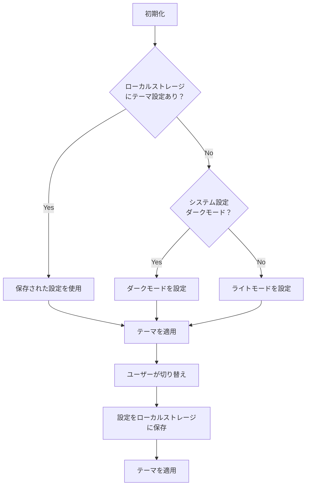

# ダークモード実装 詳細設計書

## 1. 概要

- ユーザーが選択可能なダークテーマ機能を実装
- システム設定の自動検出とユーザー選択の両方に対応
- 全体設計（`design.md`）の「UIデザイン要件」に対応

## 2. 実装仕様

### 2.1 テーマ管理システム



### 2.2 技術実装

#### 2.2.1 Tailwind CSS設定
```javascript
// tailwind.config.js
module.exports = {
  darkMode: 'class', // classベースのダークモード
  theme: {
    extend: {
      colors: {
        // カスタムカラーパレット
        primary: {
          50: '#f0f9ff',
          // ... ライト/ダーク両対応
          900: '#0c4a6e'
        }
      }
    }
  }
}
```

#### 2.2.2 テーマストア
- `src/lib/stores/theme.ts` - Svelteストアでテーマ管理
- システム設定検出、ローカルストレージ連携
- テーマ切り替え関数の提供

### 2.3 コンポーネント設計

#### 2.3.1 テーマ関連コンポーネント
- `src/lib/components/ui/ThemeToggle.svelte` - テーマ切り替えボタン
- `src/lib/components/ui/ThemeProvider.svelte` - テーマ初期化ラッパー

#### 2.3.2 既存コンポーネントの修正
- 全コンポーネントのクラス名にダークモード対応を追加
- `dark:` プレフィックスを使用したスタイル定義

## 3. データモデル

### 3.1 ローカルストレージ
```typescript
interface ThemeSettings {
  mode: 'light' | 'dark' | 'system';
  preference: 'light' | 'dark'; // システムモード時の実際の表示
}
```

### 3.2 テーマストア型定義
```typescript
interface ThemeStore {
  current: 'light' | 'dark';
  mode: 'light' | 'dark' | 'system';
  toggle: () => void;
  setMode: (mode: 'light' | 'dark' | 'system') => void;
}
```

## 4. UI/UXデザイン

### 4.1 カラーパレット

#### ライトモード
- 背景: `bg-white`, `bg-gray-50`
- テキスト: `text-gray-900`, `text-gray-600`
- ボーダー: `border-gray-200`
- アクセント: `bg-indigo-600`, `text-indigo-600`

#### ダークモード
- 背景: `dark:bg-gray-900`, `dark:bg-gray-800`
- テキスト: `dark:text-gray-100`, `dark:text-gray-300`
- ボーダー: `dark:border-gray-700`
- アクセント: `dark:bg-indigo-500`, `dark:text-indigo-400`

### 4.2 テーマ切り替えUI
- ヘッダーに太陽/月アイコンのトグルボタン
- 管理画面の設定エリアにテーマ選択
- システム設定連動オプション

### 4.3 アニメーション
- テーマ切り替え時のスムーズなトランジション
- `transition-colors duration-200` を使用

## 5. テスト計画

### 5.1 ユニットテスト
- テーマストアの状態管理テスト
- ローカルストレージ連携テスト
- システム設定検出テスト

### 5.2 統合テスト
- テーマ切り替え時のコンポーネント再描画
- ページ遷移時のテーマ維持

### 5.3 E2Eテスト
- ユーザーによるテーマ切り替えフロー
- ブラウザリロード時のテーマ保持
- システム設定変更時の自動切り替え

### 5.4 視覚回帰テスト
- ライト/ダークモード両方のスクリーンショット比較
- アクセシビリティテスト（コントラスト比確認）

## 6. 関連ドキュメント

- [全体設計書](../../design.md) - UIデザイン要件
- [Phase 6 Issue定義書](../../issues/phase-6/) - 関連Issue一覧