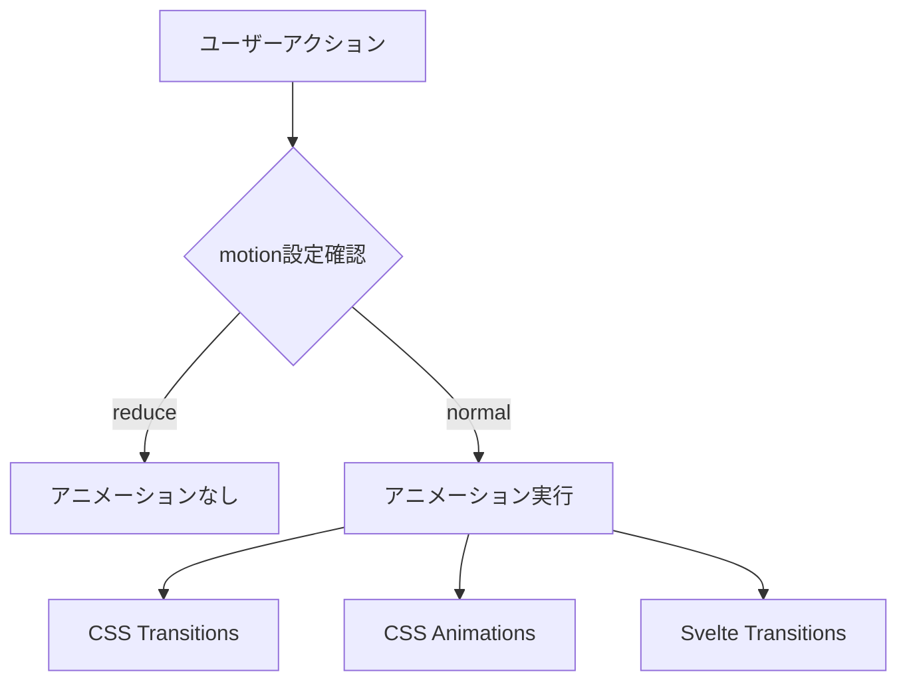

# アニメーション実装 詳細設計書

## 1. 概要

- ユーザー体験を向上させるためのマイクロアニメーションを実装
- パフォーマンスを考慮した軽量なアニメーション
- アクセシビリティ設定（prefers-reduced-motion）に対応

## 2. 実装仕様

### 2.1 アニメーション戦略



### 2.2 実装技術

#### 2.2.1 CSS-based アニメーション
- Tailwind CSS のトランジション・アニメーション
- カスタムCSS keyframes（必要な場合のみ）

#### 2.2.2 Svelte Transitions
- `fly`, `fade`, `slide` などの組み込みトランジション
- カスタムトランジション関数

#### 2.2.3 Intersection Observer
- スクロール連動アニメーション
- 要素の表示タイミング制御

### 2.3 コンポーネント設計

#### 2.3.1 アニメーション関連コンポーネント
- `src/lib/components/ui/FadeIn.svelte` - フェードイン効果
- `src/lib/components/ui/SlideUp.svelte` - スライドアップ効果
- `src/lib/components/ui/Stagger.svelte` - 段階的表示効果

#### 2.3.2 アニメーション用ユーティリティ
- `src/lib/utils/animations.ts` - アニメーション関数集
- `src/lib/utils/intersection.ts` - Intersection Observer ヘルパー

## 3. データモデル

### 3.1 アニメーション設定
```typescript
interface AnimationConfig {
  duration: number;        // ミリ秒
  delay: number;          // ミリ秒
  easing: string;         // CSS easing function
  threshold: number;      // Intersection Observer閾値
}

interface MotionPreference {
  reduceMotion: boolean;  // prefers-reduced-motion
}
```

## 4. UI/UXデザイン

### 4.1 ページ遷移アニメーション
- ページロード時の要素段階表示
- ナビゲーション時のスムーズトランジション

### 4.2 インタラクションアニメーション
- ボタンホバー効果
- カードホバー時の軽微な変形
- フォーカス時のアウトライン表示

### 4.3 コンテンツアニメーション
- 記事カードの段階的表示
- 画像のレイジーロード時フェード
- ローディング状態の表示

### 4.4 フィードバックアニメーション
- フォーム送信時のローディング
- 成功・エラー時のトースト表示
- モーダルの開閉アニメーション

### 4.5 アニメーション仕様

#### 4.5.1 基本設定
- デフォルト継続時間: 150-300ms
- イージング: `cubic-bezier(0.4, 0, 0.2, 1)` (Tailwind ease-out)
- 遅延: 0-100ms（段階表示時）

#### 4.5.2 具体的なアニメーション

**記事カード**
```css
.post-card {
  @apply transform transition-all duration-300 ease-out;
  @apply hover:scale-105 hover:shadow-lg;
}
```

**フェードイン（スクロール連動）**
```javascript
// Svelte transition
export function fadeInUp(node, { duration = 300, delay = 0 }) {
  return {
    duration,
    delay,
    css: (t) => `
      transform: translateY(${(1 - t) * 20}px);
      opacity: ${t};
    `
  };
}
```

## 5. テスト計画

### 5.1 ユニットテスト
- アニメーション関数の動作確認
- 設定値による挙動の差異確認

### 5.2 統合テスト
- コンポーネント間のアニメーション連携
- ページ遷移時のアニメーション

### 5.3 E2Eテスト
- ユーザーインタラクションでのアニメーション発火
- prefers-reduced-motion設定時の動作確認

### 5.4 パフォーマンステスト
- アニメーション実行時のFPS測定
- メモリ使用量の監視
- モバイルデバイスでのパフォーマンス確認

### 5.5 アクセシビリティテスト
- キーボード操作時のフォーカス表示
- スクリーンリーダー使用時の動作

## 6. 関連ドキュメント

- [全体設計書](../../design.md) - UIデザイン要件
- [Phase 6 Issue定義書](../../issues/phase-6/) - 関連Issue一覧