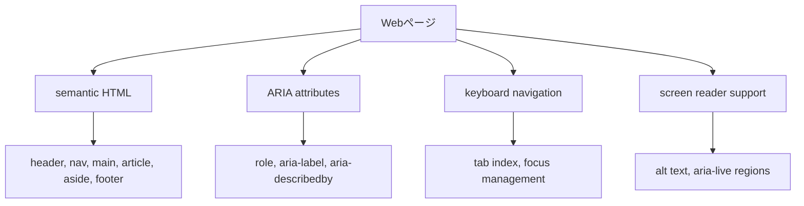

# アクセシビリティ対応 詳細設計書

## 1. 概要

- WAI-ARIA準拠のアクセシビリティ機能を実装
- キーボード操作対応とスクリーンリーダー対応
- WCAG 2.1 AAレベルの準拠を目指す
- 全体設計（`design.md`）の「アクセシビリティ要件」に対応

## 2. 実装仕様

### 2.1 ARIA属性実装



### 2.2 実装項目

#### 2.2.1 セマンティックHTML

- 適切なHTMLタグの使用
- 見出しの階層構造（h1-h6）
- ランドマーク要素の適切な配置

#### 2.2.2 キーボードナビゲーション

- Tab順序の論理的な設定
- カスタムコンポーネントのキーボード操作
- フォーカス管理とフォーカストラップ

#### 2.2.3 スクリーンリーダー対応

- 画像のalt属性
- フォームラベルの適切な関連付け
- 動的コンテンツの読み上げ対応

### 2.3 コンポーネント設計

#### 2.3.1 アクセシビリティ関連コンポーネント

- `src/lib/components/a11y/SkipLink.svelte` - スキップリンク
- `src/lib/components/a11y/ScreenReaderOnly.svelte` - スクリーンリーダー専用テキスト
- `src/lib/components/a11y/FocusTrap.svelte` - フォーカストラップ

#### 2.3.2 既存コンポーネントの修正

- ナビゲーションメニューのARIA属性追加
- フォームコンポーネントのラベル関連付け
- モーダル・ドロップダウンのキーボード操作対応

## 3. データモデル

### 3.1 アクセシビリティ設定

```typescript
interface A11yConfig {
	announcements: string[]; // スクリーンリーダー用お知らせ
	focusManagement: boolean; // フォーカス管理の有効化
	keyboardShortcuts: boolean; // キーボードショートカット
}

interface A11yPreferences {
	reduceMotion: boolean; // アニメーション削減
	highContrast: boolean; // ハイコントラスト
	fontSize: 'small' | 'medium' | 'large'; // フォントサイズ
}
```

## 4. UI/UXデザイン

### 4.1 視覚的アクセシビリティ

#### 4.1.1 色彩・コントラスト

- WCAG AAレベルのコントラスト比（4.5:1以上）
- 色のみに依存しない情報伝達
- ダークモード対応時のコントラスト確保

#### 4.1.2 フォント・レイアウト

- 読みやすいフォントサイズ（16px以上）
- 行間の適切な設定（1.5倍以上）
- 十分なクリック領域（44px以上）

### 4.2 キーボード操作

#### 4.2.1 ナビゲーション

- Tab/Shift+Tabでの順次移動
- Enter/Spaceでの決定操作
- Escapeでのモーダル・メニュー閉じる

#### 4.2.2 ショートカット

- `/` - 検索フォーカス
- `?` - ヘルプ表示
- `Ctrl+/` - キーボードショートカット一覧

### 4.3 スクリーンリーダー対応

#### 4.3.1 コンテンツ構造

```html
<!-- 記事カード例 -->
<article role="article" aria-labelledby="post-title-1">
	<h3 id="post-title-1">記事タイトル</h3>
	<p aria-describedby="post-meta-1">記事の概要...</p>
	<div id="post-meta-1" class="sr-only">投稿日: 2024年1月1日, カテゴリ: 技術, 著者: John Doe</div>
	<a href="/posts/example" aria-label="記事「記事タイトル」を読む"> 続きを読む </a>
</article>
```

#### 4.3.2 動的コンテンツ

- `aria-live` 属性でリアルタイム更新を通知
- フォーム送信結果の読み上げ
- ページ遷移時の状態通知

### 4.4 フォームアクセシビリティ

#### 4.4.1 ラベル・説明

```html
<!-- 管理画面フォーム例 -->
<div class="form-group">
	<label for="post-title" class="required">
		記事タイトル
		<span class="sr-only">必須項目</span>
	</label>
	<input
		id="post-title"
		type="text"
		aria-describedby="title-help title-error"
		aria-invalid="false"
		required
	/>
	<div id="title-help" class="help-text">SEOに効果的なタイトルを入力してください</div>
	<div id="title-error" class="error-text" aria-live="polite">
		<!-- エラーメッセージがここに表示される -->
	</div>
</div>
```

#### 4.4.2 エラーハンドリング

- エラー発生時のフォーカス移動
- エラーメッセージの明確な表示
- 修正方法の提示

## 5. テスト計画

### 5.1 自動テスト

- axe-core を使用したアクセシビリティテスト
- Lighthouse のアクセシビリティ監査
- Pa11y によるコマンドラインテスト

### 5.2 手動テスト

#### 5.2.1 キーボードテスト

- Tab順序の確認
- すべての機能のキーボード操作可能性
- フォーカス表示の視認性

#### 5.2.2 スクリーンリーダーテスト

- NVDA/JAWS/VoiceOver での読み上げ確認
- コンテンツの理解しやすさ
- ナビゲーションの効率性

#### 5.2.3 視覚テスト

- ハイコントラストモードでの表示
- 200%ズーム時のレイアウト
- 色覚異常シミュレーション

### 5.3 ユーザビリティテスト

- 実際の障害者ユーザーによるテスト
- 支援技術を使用した操作確認
- フィードバックの収集と改善

## 6. 関連ドキュメント

- [全体設計書](../../design.md) - アクセシビリティ要件
- [WCAG 2.1 ガイドライン](https://www.w3.org/TR/WCAG21/)
- [WAI-ARIA オーサリングプラクティス](https://www.w3.org/WAI/ARIA/apg/)
- [Phase 6 Issue定義書](../../issues/phase-6/) - 関連Issue一覧
