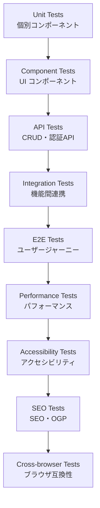

# Phase 7.5 全機能統合テスト・品質保証 詳細設計書

## 1. 概要

Phase 7.5は、これまで実装してきた全ての機能（Phase 1-7）を対象とした包括的な統合テストと品質保証を実施するフェーズです。特に、Phase 7の最終段階で先送りされたLighthouse CI 500エラーの解決を含む、アプリケーション全体の品質保証を行います。

**解決する課題：**

- Lighthouse CI実行時の500エラー
- 全実装機能の統合動作確認
- 本番環境での品質基準の確保
- パフォーマンス・アクセシビリティ・SEO基準の統合検証
- E2Eテストによる全機能の動作確認
- 品質ゲートの確立

**対象機能（Phase 1-7の全実装内容）：**

- Phase 1: プロジェクト初期化・GitHub設定
- Phase 2: MDsvex設定・基本機能
- Phase 3: データベース設定・認証・CRUD API
- Phase 4: 管理画面UI・リッチテキストエディタ
- Phase 5: 公開API・管理API・メディアアップロード
- Phase 6: レスポンシブデザイン・ダークモード・アクセシビリティ
- Phase 7: SEO最適化・OGP対応・パフォーマンス改善・Lighthouse対応

**関連する全体設計項目：**

- 8.1 品質保証戦略
- 8.2 テスト自動化
- 8.3 継続的品質改善

## 2. 実装仕様

### 2.1 Lighthouse CI 500エラーの解決

**問題の特定と対策：**

1. **環境変数の設定**
    - CI環境での環境変数の適切な設定
    - データベースURL、セッションシークレット、認証設定の確認

2. **公開APIの検証**
    - `src/routes/+page.server.ts`のpublicApi呼び出し確認
    - `src/lib/api/index.ts`のAPIクライアント実装確認
    - エラーハンドリングの改善

3. **データベースの初期化**
    - CI環境でのデータベースマイグレーション確認
    - シードデータの適切な投入
    - テストデータの準備

4. **認証システムの検証**
    - Auth.jsの設定確認
    - セッション管理の検証
    - 管理画面アクセス権限の確認

### 2.2 全機能統合テストフレームワーク

**テスト階層の構築：**



**実装コンポーネント：**

1. **テストユーティリティ**
    - `src/lib/test-utils/`
    - テストヘルパー関数
    - モックデータ生成
    - 認証モック

2. **統合テストスイート**
    - `tests/integration/`
    - API統合テスト
    - データベース統合テスト
    - 認証フローテスト

3. **E2Eテストスイート**
    - `tests/e2e/`
    - 全ユーザージャーニーテスト
    - 管理画面操作テスト
    - レスポンシブデザインテスト

### 2.3 機能別テスト計画

**Phase 1-2: 基盤機能テスト**

- プロジェクト構成の確認
- MDsvex動作確認
- 基本ルーティング確認

**Phase 3: データベース・認証テスト**

- データベース接続・マイグレーション
- CRUD API動作確認
- 認証フロー確認

**Phase 4: 管理画面テスト**

- 管理画面UI動作確認
- 記事・カテゴリCRUD操作
- リッチテキストエディタ動作

**Phase 5: API統合テスト**

- 公開API動作確認
- 管理API動作確認
- メディアアップロード機能

**Phase 6: UI/UX テスト**

- レスポンシブデザイン確認
- ダークモード動作確認
- アクセシビリティ基準確認

**Phase 7: SEO・パフォーマンステスト**

- メタタグ最適化確認
- OGP対応確認
- パフォーマンス指標確認

### 2.4 CI/CDパイプラインの強化

**GitHub Actions ワークフロー：**

1. **品質ゲート設定**
    - 必須チェック項目の明確化
    - 失敗時のロールバック戦略
    - 段階的テスト実行

2. **並列テスト実行**
    - テスト実行時間の短縮
    - リソースの効率的利用
    - テストマトリックスの最適化

3. **レポート生成**
    - テスト結果の可視化
    - 品質メトリクスの追跡
    - カバレッジレポート

## 3. データモデル

### 3.1 テストデータベース

**テスト用データの管理：**

```typescript
// src/lib/test-utils/seed-test-data.ts
export interface TestDataSet {
	posts: Post[];
	categories: Category[];
	users: User[];
	sessions: Session[];
}

export const createTestData = (): TestDataSet => {
	return {
		posts: [
			{
				id: 'test-post-1',
				title: 'テスト記事1',
				slug: 'test-post-1',
				content: 'テスト記事の内容',
				excerpt: 'テスト記事の概要',
				status: 'published',
				categoryId: 'test-category-1',
				createdAt: new Date(),
				updatedAt: new Date(),
				metaTitle: 'テスト記事1 - メタタイトル',
				metaDescription: 'テスト記事1のメタディスクリプション',
				ogTitle: 'テスト記事1 - OGタイトル',
				ogDescription: 'テスト記事1のOGディスクリプション',
				ogImage: '/images/test-og-image.jpg'
			}
		],
		categories: [
			{
				id: 'test-category-1',
				name: 'テストカテゴリ1',
				slug: 'test-category-1',
				description: 'テストカテゴリの説明',
				createdAt: new Date(),
				updatedAt: new Date()
			}
		],
		users: [
			{
				id: 'test-user-1',
				email: 'test@example.com',
				name: 'テストユーザー',
				role: 'admin',
				createdAt: new Date(),
				updatedAt: new Date()
			}
		],
		sessions: []
	};
};
```

### 3.2 テスト結果の記録

**品質メトリクスの追跡：**

```typescript
// src/lib/types/quality-metrics.ts
export interface QualityMetrics {
	lighthouse: {
		performance: number;
		accessibility: number;
		bestPractices: number;
		seo: number;
		pwa: number;
	};
	coreWebVitals: {
		lcp: number;
		fid: number;
		cls: number;
	};
	testResults: {
		unit: TestResult;
		integration: TestResult;
		e2e: TestResult;
	};
	timestamp: Date;
	commitHash: string;
}

export interface TestResult {
	total: number;
	passed: number;
	failed: number;
	coverage: number;
}
```

## 4. UI/UXデザイン

### 4.1 品質ダッシュボード

**品質メトリクスの可視化：**

- Lighthouse スコアの推移グラフ
- Core Web Vitals の推移
- テスト結果の詳細表示
- パフォーマンス指標のトレンド
- アクセシビリティ評価結果
- SEO評価結果

### 4.2 開発者向けツール

**デバッグ・テスト支援：**

- テスト結果の詳細表示
- パフォーマンス分析ツール
- アクセシビリティチェッカー
- SEO診断ツール

## 5. テスト計画

### 5.1 Lighthouse CI修復テスト

**テストシナリオ：**

1. **環境変数テスト**
    - CI環境での環境変数設定の検証
    - 各種APIキーの有効性確認
    - データベース接続情報の確認

2. **データベース接続テスト**
    - マイグレーション実行の確認
    - データアクセスの正常性確認
    - テストデータの投入確認

3. **API動作テスト**
    - 全APIエンドポイントの200レスポンス確認
    - エラーハンドリングの検証
    - 認証APIの動作確認

4. **認証システムテスト**
    - Auth.jsの設定確認
    - セッション管理の検証
    - 管理画面アクセス権限の確認

### 5.2 全機能統合テスト

**テストケース：**

1. **基盤機能テスト**
    - プロジェクト構成の検証
    - 基本ルーティングの確認
    - MDsvex動作の確認

2. **データベース・API テスト**
    - 記事CRUD操作の確認
    - カテゴリCRUD操作の確認
    - 認証フローの確認
    - データ整合性の確認

3. **管理画面テスト**
    - ログイン・ログアウト機能
    - 記事作成・編集・削除機能
    - カテゴリ管理機能
    - リッチテキストエディタ機能
    - メディアアップロード機能

4. **公開サイトテスト**
    - 記事一覧表示の確認
    - 記事詳細表示の確認
    - カテゴリ別表示の確認
    - 検索機能の確認

5. **パフォーマンステスト**
    - Core Web Vitals の基準値確認
    - レスポンス時間の測定
    - リソース使用量の監視
    - 画像最適化の効果確認

6. **アクセシビリティテスト**
    - WCAG 2.1 AA準拠の確認
    - スクリーンリーダー対応の検証
    - キーボードナビゲーションの確認
    - 色覚異常対応の確認

7. **SEOテスト**
    - メタタグの適切な設定確認
    - OGPタグの検証
    - 構造化データの確認
    - サイトマップの生成確認

### 5.3 E2Eテスト

**テストシナリオ：**

1. **ユーザージャーニーテスト**
    - 一般訪問者の記事閲覧フロー
    - 管理者のコンテンツ管理フロー
    - レスポンシブデザインの検証

2. **ブラウザ互換性テスト**
    - Chrome、Firefox、Safari、Edge対応確認
    - モバイルブラウザ対応確認
    - 異なる解像度での表示確認

3. **パフォーマンステスト**
    - 各ページの読み込み時間測定
    - 画像最適化の効果確認
    - キャッシュ動作の検証
    - PWA機能の検証

## 6. 実装マイルストーン

### 6.1 Phase 1: 問題分析・環境整備（2-3日）

**実装タスク：**

1. Lighthouse CI 500エラーの詳細分析
2. CI環境の環境変数設定確認
3. データベース初期化プロセスの検証
4. 認証システムの設定確認
5. テスト環境の構築

**完了基準：**

- エラー原因の特定完了
- 修正方針の確定
- テスト環境の稼働確認
- 全Phase機能の動作確認

### 6.2 Phase 2: Lighthouse CI修復（3-4日）

**実装タスク：**

1. 500エラーの根本原因修正
2. CI設定の最適化
3. エラーハンドリングの強化
4. リトライ機構の実装
5. 環境変数の整備

**完了基準：**

- Lighthouse CI の正常動作確認
- 全テストの通過
- 品質基準の達成
- CI/CDパイプラインの安定化

### 6.3 Phase 3: 統合テスト強化（4-5日）

**実装タスク：**

1. テストフレームワークの拡張
2. Phase 1-7 全機能の統合テストスイート作成
3. パフォーマンステストの実装
4. アクセシビリティテストの実装
5. SEOテストの実装

**完了基準：**

- 全機能統合テストスイートの完成
- 全テストの通過確認
- 品質メトリクスの可視化
- テストカバレッジの確保

### 6.4 Phase 4: E2Eテスト・品質保証（3-4日）

**実装タスク：**

1. E2Eテストスイートの作成
2. ブラウザ互換性テスト
3. パフォーマンステスト
4. 品質ダッシュボードの作成
5. 運用ガイドラインの作成

**完了基準：**

- E2Eテストの完成
- 品質保証プロセスの確立
- 運用ドキュメントの完成
- 継続的改善の仕組み構築

## 7. 品質基準

### 7.1 パフォーマンス基準

**Lighthouse スコア：**

- Performance: 90+
- Accessibility: 95+
- Best Practices: 90+
- SEO: 95+

**Core Web Vitals：**

- LCP: 2.5s以下
- FID: 100ms以下
- CLS: 0.1以下

### 7.2 アクセシビリティ基準

**WCAG 2.1 AA準拠：**

- 色覚異常対応
- キーボードナビゲーション
- スクリーンリーダー対応
- 適切なセマンティクス

### 7.3 SEO基準

**検索エンジン最適化：**

- 適切なメタタグ設定
- OGP対応
- 構造化データ
- サイトマップ生成

### 7.4 機能品質基準

**全機能の動作確認：**

- 記事CRUD操作の正常動作
- カテゴリ管理の正常動作
- 認証システムの正常動作
- 管理画面の正常動作
- 公開サイトの正常動作

## 8. 対象機能詳細

### 8.1 Phase 1-2: 基盤機能

- プロジェクト初期化
- GitHub設定
- MDsvex設定
- 基本ルーティング

### 8.2 Phase 3: バックエンド機能

- データベース設定（SQLite + Drizzle ORM）
- 認証システム（Auth.js）
- 記事CRUD API
- カテゴリCRUD API

### 8.3 Phase 4: 管理画面

- 管理画面UI
- 記事管理インターフェース
- カテゴリ管理インターフェース
- リッチテキストエディタ

### 8.4 Phase 5: API統合

- 公開API
- 管理API
- メディアアップロードAPI

### 8.5 Phase 6: UI/UX

- レスポンシブデザイン
- ダークモード
- アニメーション
- アクセシビリティ対応

### 8.6 Phase 7: SEO・パフォーマンス

- メタタグ最適化
- OGP対応
- パフォーマンス改善
- Lighthouse最適化

## 9. 運用・監視

### 9.1 継続的品質監視

**監視項目：**

- Lighthouse スコアの推移
- エラー発生状況
- パフォーマンス指標
- ユーザビリティ指標
- 全機能の動作状況

### 9.2 アラート設定

**通知条件：**

- スコア低下時の通知
- エラー発生時の通知
- パフォーマンス劣化時の通知
- 機能障害時の通知

## 10. 関連ドキュメント

- [全体設計書](../../design.md)
- [Phase 1-7 設計書](../phase-1/ から ../phase-7/)
- [Issue定義書](../../issues/phase-7.5/)
- [テストガイドライン](../../testing-guidelines.md)
- [品質保証ガイドライン](../../quality-assurance.md)

## 11. リスク管理

### 11.1 技術的リスク

**リスク項目：**

- 500エラーの複雑な原因
- CI環境の制約
- テスト実行時間の増加
- 既存機能の回帰

**対策：**

- 段階的な修正アプローチ
- 並列テスト実行
- タイムアウト設定の調整
- 回帰テストの強化

### 11.2 スケジュールリスク

**リスク項目：**

- 原因特定の遅延
- 修正作業の長期化
- テスト作成の工数増加

**対策：**

- 詳細な問題分析
- 代替案の準備
- 段階的リリース
- 優先度の明確化

### 11.3 品質リスク

**リスク項目：**

- テストカバレッジの不足
- 品質基準の未達成
- 本番環境での問題発生

**対策：**

- 包括的テスト計画
- 品質基準の段階的達成
- 本番環境での継続監視
