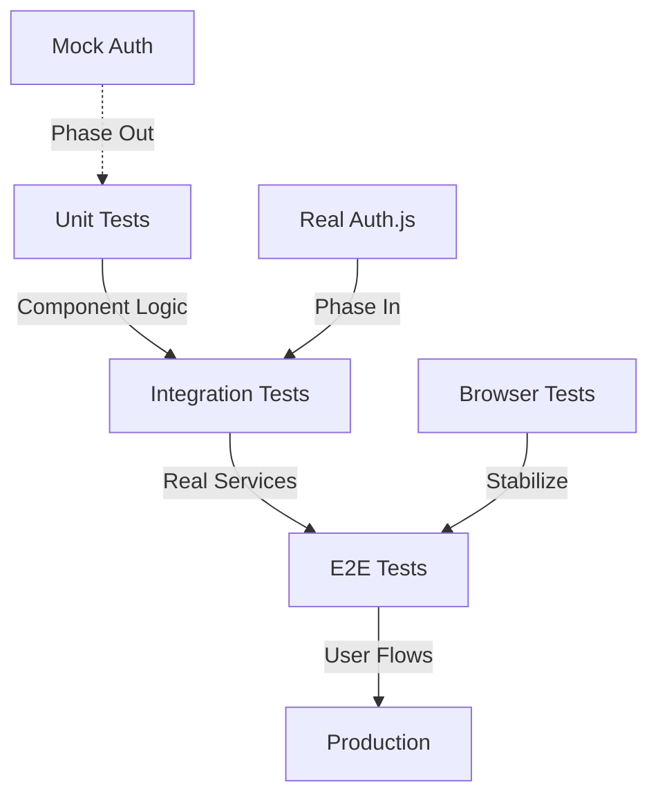
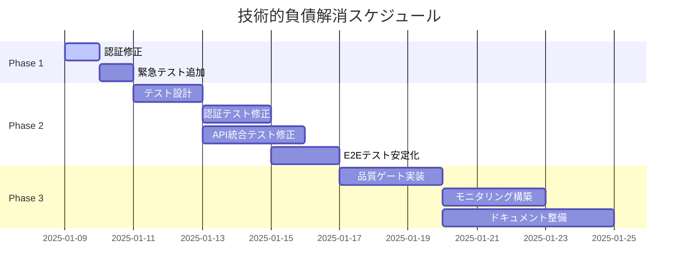

# 技術的負債解消計画 詳細設計書

## 1. 概要

- 本設計書は、Issue #101で発覚した記事投稿エラーの根本原因である技術的負債を体系的に解消するための計画を定義します。
- テスト実装の量的充実にも関わらず、実環境での重大バグを検出できなかった構造的問題を解決します。
- 関連する全体設計: `design.md` - 品質保証体制、テスト戦略

## 2. 実装仕様

### 2.1 Phase 1: 緊急対応（1-2日）

#### 認証システムの修正

```typescript
// Before: 不完全な認証実装
const session = await locals.getSession?.();
const userId = session?.user?.id; // undefined になる可能性

// After: 適切なエラーハンドリング
export const POST: RequestHandler = async ({ request, locals }) => {
  try {
    const session = await locals.getSession();
    if (!session?.user?.id) {
      return json({ error: 'Unauthorized' }, { status: 401 });
    }
    // 処理継続
  } catch (error) {
    console.error('Authentication error:', error);
    return json({ error: 'Authentication failed' }, { status: 500 });
  }
};
```

#### 最小限の統合テスト追加

```typescript
// tests/integration/api/admin-api-real.test.ts
import { app } from '../../../src/app';

describe('Real Admin API Integration', () => {
  it('should create post with actual authentication', async () => {
    // 実際のログイン
    const loginRes = await app.fetch('/auth/signin/credentials', {
      method: 'POST',
      body: JSON.stringify({ username: 'admin', password: 'password' })
    });
    
    const cookies = loginRes.headers.get('set-cookie');
    
    // 実際のAPI呼び出し
    const createRes = await app.fetch('/api/admin/posts', {
      method: 'POST',
      headers: {
        'Content-Type': 'application/json',
        'Cookie': cookies
      },
      body: JSON.stringify({
        title: 'Test Post',
        content: 'Test Content'
      })
    });
    
    expect(createRes.status).toBe(201);
  });
});
```

### 2.2 Phase 2: テストアーキテクチャ再構築（1週間）

#### テスト層の再定義



#### 実装タスク

1. **認証テストの実装修正**
   - `tests/integration/auth/auth-flow-real.test.ts` - 実際のAuth.js使用
   - `tests/integration/auth/session-management-real.test.ts` - JWT検証

2. **API統合テストの修正**
   - `tests/integration/api/admin-api-real.test.ts` - 実エンドポイント
   - `tests/integration/api/public-api-real.test.ts` - 公開API

3. **E2Eテストの安定化**
   - `tests/e2e/setup-auth.ts` - 認証セットアップ自動化
   - `tests/e2e/fixtures/test-users.ts` - テストユーザー管理

### 2.3 Phase 3: 継続的改善プロセス（2週間）

#### 品質ゲートの実装

```yaml
# .github/workflows/quality-gate.yml
name: Quality Gate
on: [pull_request]

jobs:
  quality-check:
    runs-on: ubuntu-latest
    steps:
      - name: Unit Tests
        run: pnpm test:unit
        
      - name: Integration Tests (Real)
        run: pnpm test:integration:real
        
      - name: E2E Tests
        run: pnpm test:e2e
        
      - name: Security Tests
        run: pnpm test:security
        
      - name: Coverage Check
        run: pnpm coverage -- --threshold 80
```

## 3. データモデル

### 3.1 テスト環境設定の追加

```typescript
// src/lib/server/db/test-config.ts
export interface TestConfig {
  useRealAuth: boolean;
  useRealDatabase: boolean;
  testUserCredentials: {
    admin: { username: string; password: string };
    user: { username: string; password: string };
  };
}
```

## 4. UI/UXデザイン

- エラーメッセージの改善
  - 認証エラー時の具体的なメッセージ表示
  - リトライ可能なエラーの明示
  - ユーザーガイダンスの追加

## 5. テスト計画

### 5.1 段階的移行計画

| Phase | 期間 | Unit Tests | Integration Tests | E2E Tests |
|-------|------|------------|-------------------|-----------|
| Phase 1 | 1-2日 | 現状維持 | 最小限の実環境テスト追加 | 認証修正 |
| Phase 2 | 1週間 | リファクタリング | モック→実環境移行 | 安定化 |
| Phase 3 | 2週間 | カバレッジ向上 | 完全移行 | CI/CD統合 |

### 5.2 成功指標

- **短期（Phase 1完了時）**
  - 記事投稿機能の復旧: 100%
  - 認証エラー: 0件
  
- **中期（Phase 2完了時）**
  - 実環境統合テスト: 30件以上
  - E2Eテスト成功率: 95%以上
  
- **長期（Phase 3完了時）**
  - テストカバレッジ: 85%以上
  - 本番環境バグ: 50%削減

### 5.3 リスクと対策

| リスク | 影響度 | 対策 |
|--------|--------|------|
| テスト実行時間の増加 | 高 | 並列実行、キャッシュ活用 |
| 認証テストの不安定性 | 中 | リトライ機構、タイムアウト調整 |
| 既存テストの破壊 | 低 | 段階的移行、旧テスト保持 |

## 6. 関連ドキュメント

- Issue定義書: `/doc/issues/phase-7.5/issue-101-post-creation-error.md`
- 全体設計書: `/doc/design.md` - セクション8.2 テスト戦略
- 開発ガイドライン: `/doc/development.md` - テスト実装規約
- Issue #101: Critical: Article posting failure in browser

## 7. 実装スケジュール



## 8. まとめ

本計画は、テストの「量」から「質」への転換を図り、実環境での問題を確実に検出できる体制を構築します。段階的なアプローチにより、緊急対応と長期的な品質向上を両立させ、今後同様の問題が発生することを防ぎます。